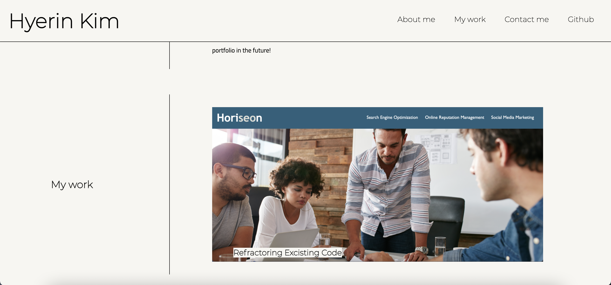
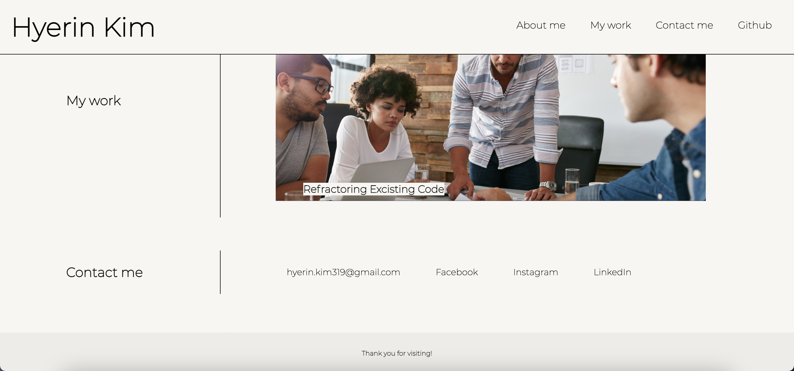

# Hyerin's Portfolio Page

## First professional portfolio 

**Description**

This portfolio website includes the following features:
- the developer's name, a recent photo, and links to sections about the developer, their work, and how to contact the developer
- links in the navigation that leads the UI to scroll to the corresponding sections
- section about the work has a link to the developer's application 
- the image of the webpage in the section about the work creates a border when UI puts the mouse over it and leads to the developer's application when it's clicked, and
- the page of the website can be resized for the various screens and devices which adapts to the viewport. 

**Screenshots of the website**

**Link to deployed application**

For the URL of the deployed application: <https://hzzrin.github.io/Hyerin-s_portfolio-page/> 

